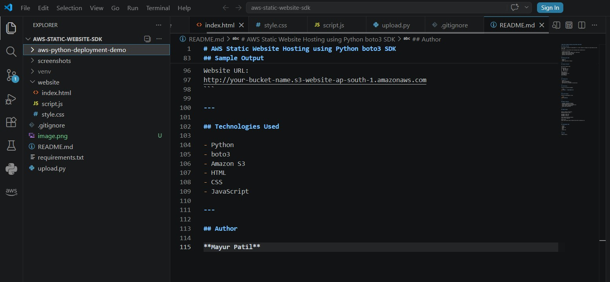
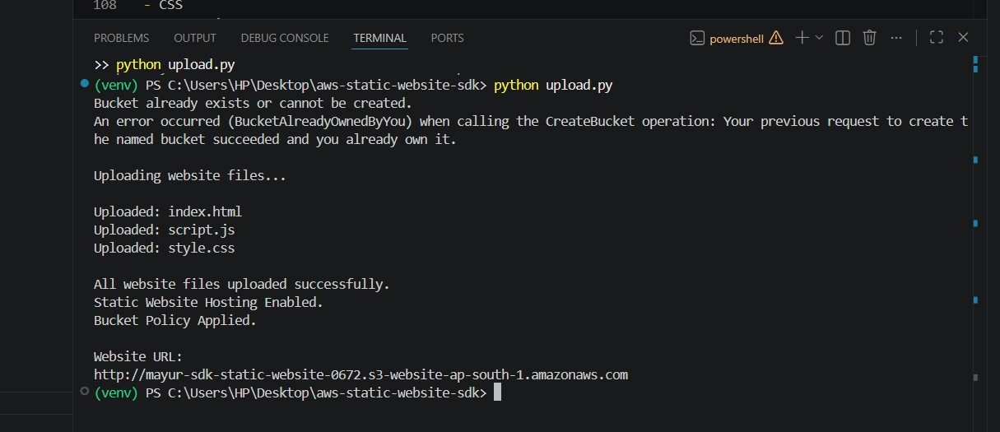
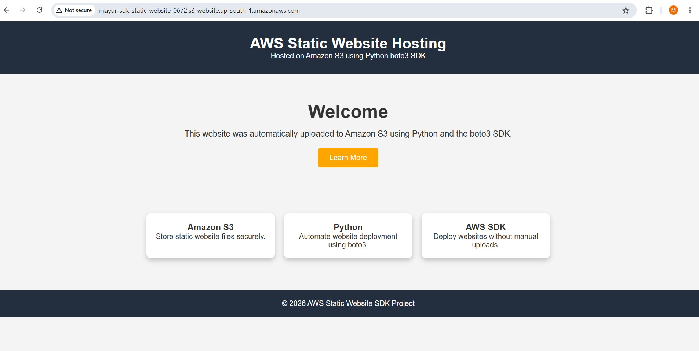
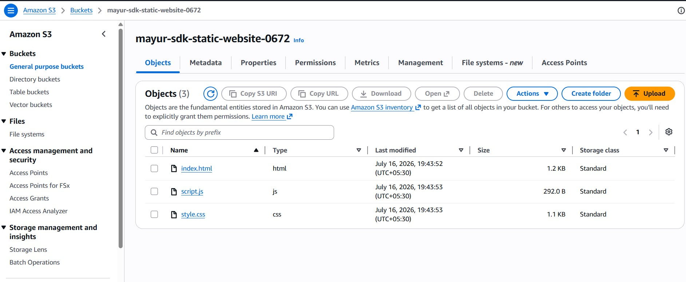

# AWS Static Website Hosting using Python boto3 SDK

## Project Overview

This project automates the deployment of a static website on Amazon S3 using Python and the boto3 SDK.

The Python script performs the following tasks automatically:

- Creates an S3 bucket
- Uploads website files (HTML, CSS, JavaScript)
- Enables Static Website Hosting
- Applies a public bucket policy
- Generates the website URL

---

## AWS Services Used

- Amazon S3
- Python
- boto3 (AWS SDK for Python)

---

## Project Structure

```text
aws-static-website-sdk/
│
├── website/
│   ├── index.html
│   ├── style.css
│   └── script.js
│
├── screenshots/
├── upload.py
├── requirements.txt
├── README.md
└── .gitignore
```

---

## Prerequisites

- Python 3.x
- AWS CLI configured
- boto3 library installed
- AWS IAM user with Amazon S3 permissions

---

## Installation

Install the required packages:

```bash
pip install -r requirements.txt
```

---

## Run the Project

Execute the deployment script:

```bash
python upload.py
```

---

## Website Features

- Automatic S3 Bucket Creation
- Automatic Website File Upload
- Static Website Hosting Configuration
- Public Access Configuration
- Website URL Generation

---

## Sample Output

```text
Bucket created successfully.
Uploading website files...

Uploaded: index.html
Uploaded: style.css
Uploaded: script.js

Static Website Hosting Enabled.
Bucket Policy Applied.

Website URL:
http://your-bucket-name.s3-website.ap-south-1.amazonaws.com
```

---

## Screenshots

### 1. Project Structure



### 2. Terminal Output



### 3. Website Output



### 4. Amazon S3 Bucket Objects



---

## Technologies Used

- Python
- boto3
- Amazon S3
- HTML
- CSS
- JavaScript

---

## Author

**Mayur Patil**